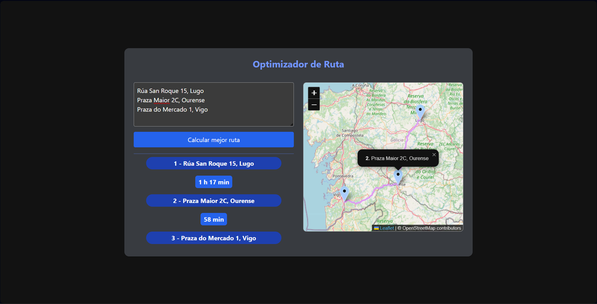
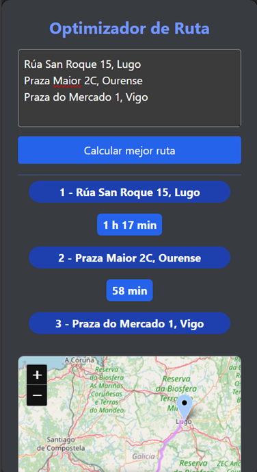

# TSP Resolver 🚗

Optimizador de rutas utilizando el algoritmo **Traveling Salesman Problem (TSP)** con interfaz web interactiva y visualización precisa de rutas en tiempo real.

## 🚀 Características

- 🗺️ **Mapa interactivo** con Leaflet.js
- 📍 **Geocodificación** de direcciones a coordenadas
- 🚀 **Optimización de rutas** con OR-Tools
- ⏱️ **Cálculo de tiempos** de viaje entre puntos
- 🛣️ **Rutas precisas** con OSRM API
- 📱 **Diseño responsive** con Tailwind CSS
- 🔄 **Visualización en tiempo real** de la ruta óptima

## 🔧 Tecnologías

### Backend
- **FastAPI** - Framework web moderno para Python
- **OR-Tools** - Biblioteca de optimización de Google
- **Nominatim API** - Geocodificación de direcciones
- **OSRM API** - Cálculo de matrices y rutas precisas
- **Pydantic** - Validación de datos

### Frontend
- **Leaflet.js** - Mapas interactivos y GeoJSON
- **Tailwind CSS** - Framework de CSS utilitario
- **JavaScript ES6+** - Lógica del cliente asíncrona

## 📋 Requisitos

- Python **3.8+**
- Node.js **16+**
- **npm** o **yarn**
- Conexión a **internet** para APIs externas

## ⚙️ Flujo de Trabajo

1. **Entrada de usuario**: Direcciones en formato texto
2. **Geocodificación**: Conversión a coordenadas con Nominatim
3. **Matriz de tiempos**: Cálculo con OSRM /table endpoint
4. **Optimización TSP**: OR-Tools encuentra el orden óptimo
5. **Ruta detallada**: OSRM /route endpoint proporciona GeoJSON
6. **Visualización**: Leaflet.js muestra marcadores + ruta precisa

## 🛠️ Instalación

### 1. Clonar el repositorio
```bash
git clone https://github.com/tu-usuario/TSPResolver.git
cd TSPResolver
```

### 2. Configurar entorno Python
```bash
# Crear entorno virtual
python -m venv venv

# Activar entorno
# Linux/Mac:
source venv/bin/activate
# Windows:
venv\Scripts\activate

# Instalar dependencias
pip install -r requirements.txt
```

### 3. Configurar frontend
```bash
cd frontend

# Instalar dependencias npm
npm install

# Compilar CSS de Tailwind
npm run build-css

# Volver al directorio principal
cd ..
```

## ▶️ Ejecución

### 1. Iniciar el servidor backend
```bash
uvicorn main:app --reload
```

### 2. Acceder a la aplicación
Abre tu navegador en: **http://localhost:8000**

## 🎯 Uso

1. **Introduce las direcciones** en el área de texto (una por línea)
2. **Haz clic en "Calcular mejor ruta"**
3. **Visualiza los resultados:**
   - 📍 Lista ordenada de direcciones con tiempos estimados
   - 🗺️ Mapa interactivo con marcadores numerados
   - 🛣️ Ruta precisa siguiendo carreteras reales
4. **Explora el mapa** haciendo clic en los marcadores para ver detalles

## 📁 Estructura del Proyecto

```
TSPResolver/
├── main.py              # Servidor FastAPI principal
├── geocodificador.py    # Lógica de geocodificación y OSRM
├── optimizador.py       # Algoritmo TSP con OR-Tools
├── requirements.txt     # Dependencias Python
├── README.md           # Documentación
├── .gitignore          # Archivos ignorados por Git
├── assets/             # Capturas de pantalla y documentación
└── frontend/           # Aplicación web
    ├── src/
    │   ├── index.html  # Página principal
    │   ├── input.css   # CSS fuente de Tailwind
    │   ├── main.js     # Lógica JavaScript
    │   └── favicon.ico # Icono de la aplicación
    ├── dist/
    │   └── output.css  # CSS compilado
    ├── package.json    # Dependencias npm
    └── tailwind.config.js # Configuración de Tailwind
```

## 🎨 Personalización

- **Mapa inicial:** Modifica las coordenadas en `main.js` (línea 35)
- **Estilos:** Edita `tailwind.config.js` para personalizar Tailwind
- **APIs:** Las APIs de Nominatim y OSRM son gratuitas y no requieren API key
- **Colores:** Personaliza los colores en `main.js` (líneas 77, 93)

## 📷 Capturas de Pantalla

| **Escritorio** | **Móvil** |
|--------------|-----------|
| {width=400} | {width=200} |

## 🐛 Problemas Comunes

### "Error geocodificando direcciones"
- Verifica tu conexión a internet
- Asegúrate que las direcciones son válidas y específicas
- Las APIs pueden tener límites de uso (espera entre solicitudes)

### "Error obteniendo tiempos de ruta"
- Revisa que las coordenadas sean válidas
- La API de OSRM puede estar temporalmente no disponible
- Reduce el número de direcciones (máximo recomendado: 10)

### El mapa no se carga
- Verifica la consola del navegador (F12)
- Asegúrate que Leaflet.js se esté cargando correctamente
- Revisa que no haya bloqueadores de anuncios

### No se muestra la ruta precisa
- Verifica que la respuesta del backend contenga `ruta_geojson`
- Revisa la consola para errores de JavaScript
- Asegúrate que OSRM esté devolviendo geometría válida

## 🤝 Contribuir

¡Las contribuciones son bienvenidas!

1. Fork el proyecto
2. Crea una rama (`git checkout -b feature/nueva-funcionalidad`)
3. Commit tus cambios (`git commit -m 'feat: añadir nueva funcionalidad'`)
4. Push a la rama (`git push origin feature/nueva-funcionalidad`)
5. Abre un Pull Request

## 📄 Licencia

Este proyecto está licenciado bajo la **MIT License** - ver el archivo [LICENSE](LICENSE) para detalles.

## 🙏 Agradecimientos

- **Google OR-Tools** - Biblioteca de optimización
- **Leaflet.js** - Biblioteca de mapas
- **OpenStreetMap** - Datos de mapas libres
- **Nominatim** - Servicio de geocodificación
- **OSRM** - Motor de rutas de código abierto
- **Tailwind CSS** - Framework de CSS utilitario